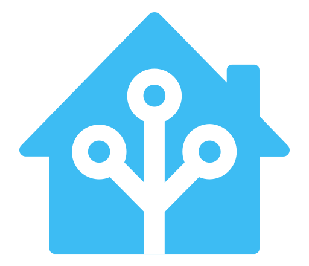
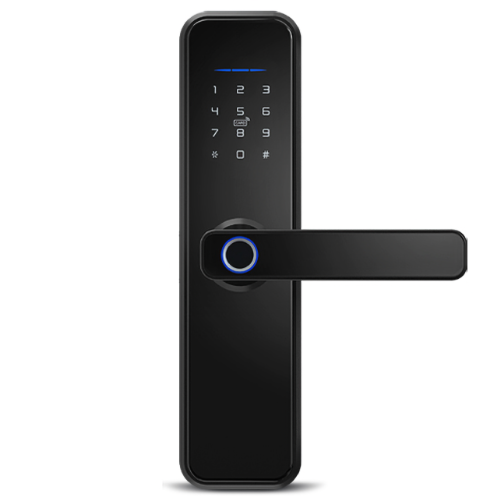
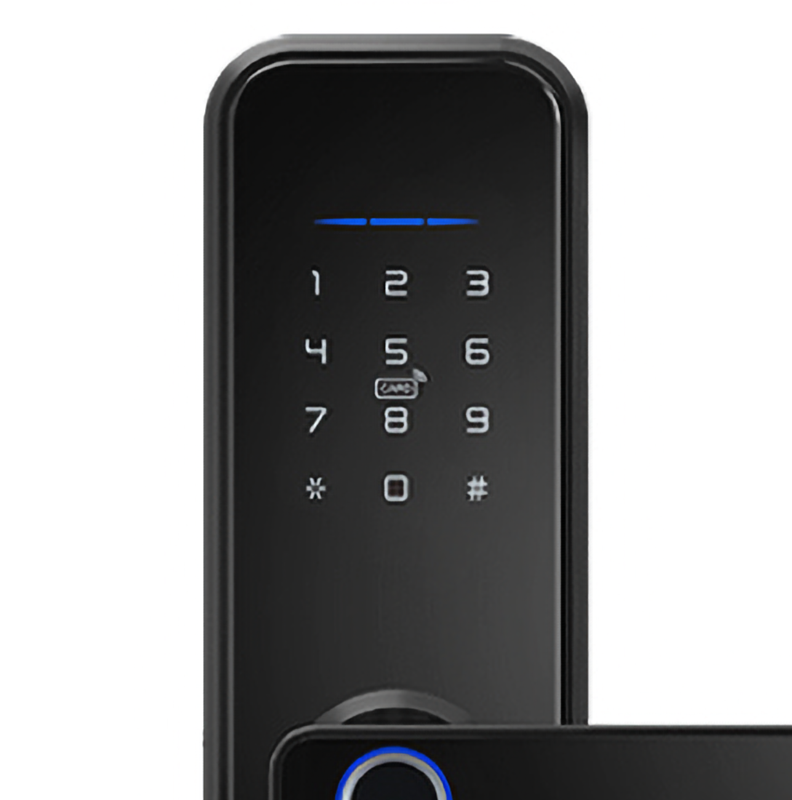

# Smart Home

_Unidade Mandarim 1614_

1. [Sou hóspede](#sou-hóspede)
2. [Fechadura Digital](#fechadura-digital)
3. [Quero me hospedar](#quero-me-hospedar)
4. [Quero automatizar meu imóvel](#quero-automatizar-meu-imóvel)
5. [Ajuda](#ajuda)

## Sou Hóspede

Queremos que você tenha a melhor experiência possível durante a sua estadia.

Você está prestes a entrar em um apartamento com **automação**, onde será possível controlar diversos dispositivos com a
voz.

Dentro do apartamento, você encontrará outros **QR Codes** como este, onde poderá obter mais informações sobre os
equipamentos.

Os dados de **acesso Wi-Fi** está em um dos QR Codes. Desafio você a encontrá-lo!

Para entrar no apartamento, você precisará digitar a **sua senha** na fechadura digital. Veja como.

## Fechadura Digital

Se você é um hóspede, a administradora [BemVIndo](https://api.whatsapp.com/send?phone=5571996444206) já te encaminhou uma senha. Veja como
acessar:

### Passo 1

Toque no painel para ativar o teclado numérico.

### Passo 2

Digite a sua **senha** seguida pela **tecla #**. Toque levemente nas teclas.

### Passo 3

Se você digitou a senha CERTA, a luz ficará **VERDE**. Gire a maçaneta para baixo para abrir a porta **antes que a luz
apague**. Se apagar, aguarde o teclado numérico apagar também e retorne ao [primeiro passo](#passo-1).

Se você digitou a senha ERRADA, a luz ficará **VERMELHA**. Aguarde o teclado numérico apagar e retorne
ao [primeiro passo](#passo-1).

### Passo 4: a senha não funciona?

Se você já **conseguiu entrar antes**, mas agora a senha não funciona mais, pode ser que você tenha ativado
a [trava interna](../fechadura_dentro).

Pra todos os casos, entre em contato com a BemVindo no [WhatsApp](https://api.whatsapp.com/send?phone=5571996444206) e
eles te ajudarão.

## Quero me hospedar

Este imóvel é administrado pela BemVindo: Imóveis por Temporada, e está disponível nas plataformas digitais. Veja as
opções de contato com a BemVindo:

- [Site](https://www.sejabemvindo.com)
- [Instagram](https://www.instagram.com/sejabemvindopontocom/)
- [WhatsApp](https://api.whatsapp.com/send?phone=5571996444206&text=Olá%2C%20gostaria%20de%20falar%20com%20a%20BemVindo)
- [E-mail](mailto:contato@sejabemvindo.com)

Responsável: **Eduardo** Gaidzakian Jorge, CRECI-BA 28019.

Viva a EXPERIÊNCIA de se hospedar em um **apartamento com automação** em uma ótima localização e
infra-estrutura.

## Quero automatizar meu imóvel

Entre em contato conosco para solicitar seu projeto de automação residencial ou de escritório
via [WhatsApp](https://api.whatsapp.com/send?phone=5571999294756&text=Olá%2C%20gostaria%20de%20automatizar%20meu%20imóvel).

## Ajuda

Em caso de dúvidas e ajuda, fale com a BemVindo
pelo [WhatsApp](https://api.whatsapp.com/send?phone=5571996444206&text=Olá%2C%20gostaria%20de%20falar%20com%20a%20BemVindo).