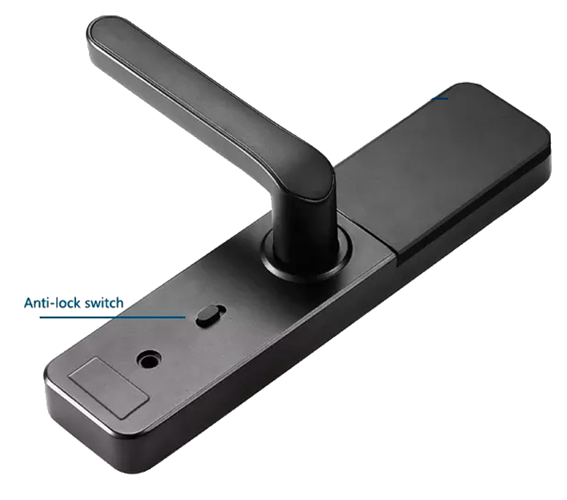

# Fechadura

Aqui, muita atenção! Existe uma trava na fechadura que impede que ela seja aberta por fora.

## Atenção!!!

Se você ativar a trava (cadeado fechado) e sair, **você não conseguirá abrir a porta** pelo lado de fora.

A sua senha foi criada apenas para você pela administradora [BemVindo](https://www.sejabemvindo.com) e não há risco de uma pessoa não autorizada entrar.

## Travando a porta

### Pelo lado de DENTRO

Basta girar a maçaneta para cima. Para garantir que a porta está bem travada, empurre um pouco a porta com a mão.

### Pelo lado de FORA

Girar a maçaneta para cima não é suficiente. Você precisará **digitar a sua senha** antes.

Quando o **sinal verde acender**, gire a maçaneta para cima.